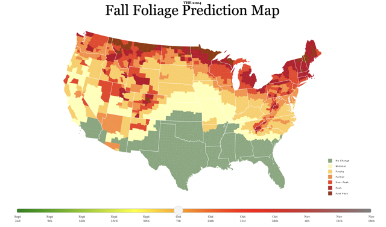

```{r setup, include = TRUE}
# keep this chunk in all your RMarkdown scripts
knitr::opts_chunk$set(echo = TRUE)
knitr::opts_chunk$set(tidy.opts = list(width.cutoff = 60), tidy = TRUE)
```


# HOMEWORK EXERCISES

In this week's homework exercises you will continue applying your ggplot skills and further manipulate figures for maximum effectiveness. You will also apply your understanding of guiding principles in data visualizations to a published chart and discuss it here. 

```{r}
library(tidyverse)
library(ggplot2)
library(palmerpenguins)
data(penguins)

```

## Exercise 1

Modify the scatter plot from this week's lab, Exercise #3, to differentiate points by species using color and shapes. 

```{r}
# Start with a basic scatter plot using geom_point() as in exercise #3, lab 4
na.omit(penguins) %>%
  ggplot(aes(x = flipper_length_mm, y = body_mass_g)) +
  geom_point()


# Add a grouping variable "species" to use for coloring. 
na.omit(penguins) %>%
  ggplot(aes(x = flipper_length_mm, y = body_mass_g)) +
  geom_point(aes(color = species))


# Change the symbol used to draw values on the plot. Try a triangle instead. Hint: explore the different symbols by looking up the help for the 'pch' argument used in plots. 
na.omit(penguins) %>%
  ggplot(aes(x = flipper_length_mm, y = body_mass_g)) +
  geom_point(pch = "triangle", aes(color = species))


# Adjust labels and plot title
na.omit(penguins) %>%
  ggplot(aes(x = flipper_length_mm, y = body_mass_g)) +
  geom_point(pch = "triangle", aes(color = species)) +
  labs(title = "Body mass to flipper length plot",
       x = "Flipper length (mm)",
       y = "Body mass (g)")


# Apply the theme_minimal() styling to the final plot
na.omit(penguins) %>%
  ggplot(aes(x = flipper_length_mm, y = body_mass_g)) +
  geom_point(pch = "triangle", aes(color = species)) +
  labs(title = "Body mass to flipper length plot",
       x = "Flipper length (mm)",
       y = "Body mass (g)") +
  theme_minimal()


# Change the font size of your axes from the default to practice the use of element_text() within the theme() function. 
na.omit(penguins) %>%
  ggplot(aes(x = flipper_length_mm, y = body_mass_g)) +
  geom_point(pch = "triangle", aes(color = species)) +
  labs(title = "Body mass to flipper length plot",
       x = "Flipper length (mm)",
       y = "Body mass (g)") +
  theme_minimal() +
  theme(axis.text = element_text(size = 12), 
        axis.title = element_text(size = 14), 
        plot.title = element_text(size = 16))

```


## Exercise 2

Expand on the grouped scatter plot object you created above by adding a regression line, similar to lab exercise #4, but now add one regression line for each species.

```{r}
# Add regression lines to scatterplot for each species
na.omit(penguins) %>%
  ggplot(aes(x = flipper_length_mm, y = body_mass_g)) +
  geom_point(pch = "triangle") +
  labs(title = "Body mass to flipper length plot",
       x = "Flipper length (mm)",
       y = "Body mass (g)") +
  theme_minimal() +
  theme(axis.text = element_text(size = 12), 
        axis.title = element_text(size = 14), 
        plot.title = element_text(size = 16)) +
  geom_smooth(method = "lm", aes(color = species))


# Match the color of each regression line to the color of the points that is used for each species
na.omit(penguins) %>%
  ggplot(aes(x = flipper_length_mm, y = body_mass_g, color = species)) +
  geom_point(pch = "triangle") +
  labs(title = "Body mass to flipper length plot",
       x = "Flipper length (mm)",
       y = "Body mass (g)") +
  theme_minimal() +
  theme(axis.text = element_text(size = 12), 
        axis.title = element_text(size = 14), 
        plot.title = element_text(size = 16)) +
  geom_smooth(method = "lm")


```


## Exercise 3

Find a figure visualizing data in any public online medium and analyze a) the things it does well, and b) where it falls short. Use the data visualization principles we discussed and reference them specifically in your answers. The figure needs to be online and from this year. Potential sources can include news outlets, online magazines, blogs, discussion forums, and journal articles as long as you can obtain a web address for the image published therein. See below for how to pull the image into your knitted PDF. Below the code chunk, write your analysis of the image. 

```{r}

# Obtain the image URL. For most online sources, this can be done by right-clicking the image and selecting "copy image address" or you can often open the image in its own browser window and copy the web address from there. Paste the URL here as a backup in case the below process doesn't work. 
# https://smokymountains.com/fall-foliage-map

# Insert the image into the knitted PDF directly from its web address by replacing the "YOUR URL HERE" below with the URL from above. Note: This may not work with certain formats like SVG file extensions and will also not work with interactive graphs. If you get an error because of file not found or for other reasons, download the image or save a screenshot of the image on your desktop and replace the "YOUR URL HERE" with the file path including file extension instead. If you still have issues, talk to us for troubleshooting. 



```

Answer: 
I think this image does a good job at visualizing how fall foliage colors in the US could change over time. The usage of color is for a specific purpose and isn't overly-saturated; the contrast, hues, and saturation of the colors is well-balanced across the image and the colors don't over-encode information. It helps with the clarity of the map that the colors used actually correspond directly to colors of leaves that can be observed in the respective locations across the map. The data-to-ink ratio is also done well, as the main colored map is surrounded by ample white space and there isn't any other unnecessary imagery or effects. The borders between the states and counties are white instead of a darker color, which keeps the image light and avoids adding too much visual clutter. I think that the legend and slider labels could be a larger font size, as the current font is rather small which makes them hard to read. Increasing the font size of the labels would make this visualization much better and remove most areas for critique. Overall, this visualization is a clear and simple way to visualize predictions for fall foliage changes over time based on location, though it could be improved with a larger font size for the legend and slider labels. 

